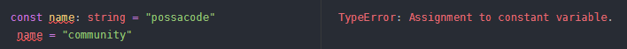
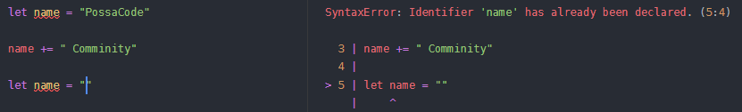
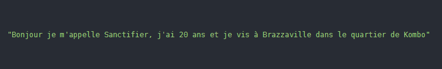
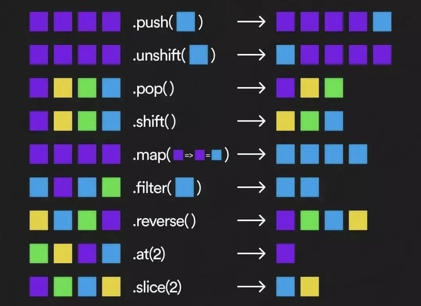
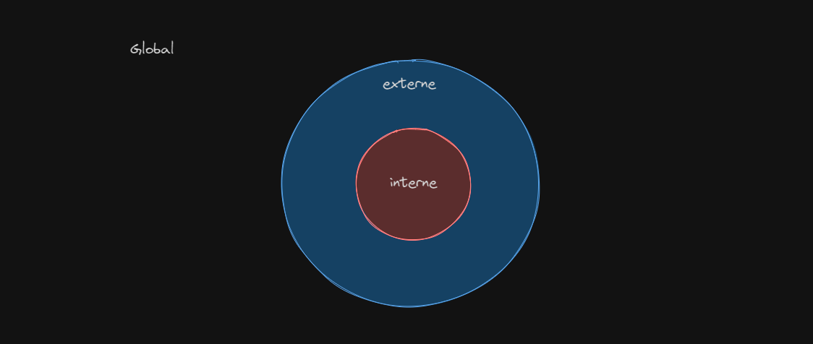

<h1 align="center">Bienvenue sur l'essentiel du JavaScript pour React.</h1>

Dans ce cours dedié au renforcement du JavaScript nous allons apprendre quelques concepts du JavaScript qu'il faut connaitre avant de commencer à travailler avec React.

### JavaScript concepts

- const/let
- Objects/Arrays
- Array methods (filter, find, etc.)
- Spread operator
- array/object destructuring
- import/export
- lexical scope
- Immutability
- Promises
- Fetch API

#### 👉 const / let

- **const**, en JavaScript `const` est utilisé pour definir une variable qui ne peut être changer ou modifier ni réinsigner. Par exemple:

  ```js
  const name = "possacode";
  ```

  
  Cette variable `name` ne peut être redeclarer ni modifier, mais un object ou un tableau declaré avec `const`, peut etre mis à jour.

  Par exemple:

  ```js
  const numbers = [1, 2, 3, 4, 5];
  numbers.push(6);

  console.log(numbers); // [1, 2, 3, 4, 5, 6]

  const person = {
    name: "Fariol",
    email: "contact@possacode.com",
  };
  person.name = "Sanctifier";

  console.log(person); // person = {name: "Sanctifier", email:"contact@possacode.com"}
  ```

- **let**, en JavaScript, on utlilise `let` pour définir une variable qui peut être reinsigner mais ne peut pas etre rédeclarer.

  Par exemple:

  ```js
  let name = "PossaCode";
  name += " community";

  console.log(name); // PossaCode community
  ```

  

  #### ⚡QUIZ

    <details>
    <summary><b> Question ❓</b></summary>

        Quelle est la valeur de b ...???

        (function(){
            let a=b=5
        })();

        console.log(b)

    </details>

     <details>
    <summary><b> Réponse ❇️</b></summary>

        5

    </details>

#### 👉 Objects / Arrays

- **Objects**, En JavaScript, un objet est une collection de propriétés, où chaque propriété est une paire `clé-valeur`. Les valeurs peuvent être de différents types de données, y compris d'autres objets, des fonctions, des chaînes de caractères, des nombres, etc.

  Par exemple:

  ```javascript
  const obj = { key: "value" }; // Structure of an object

  const person = {
    nom: "Sanctifier", //Type string (Chaine de caractères)
    age: 20, //Type number (type  nombre)
    adresse: {
      ville: "Brazzaville",
      quarrier: "Kombo",
    },
    presentation: function () {
      console.log(
        `Bonjour je m'appelle ${this.nom}, j'ai ${this.age} ans et je vis à ${this.adresse.ville} dans le quartier de ${this.adresse.quarrier}`
      );
    },
  };
  ```

  

- **Objects**, En JavaScript, un tableau est une structure de données qui permet de stocker plusieurs valeurs dans une seule variable. Il peut contenir des éléments de différents types de données, tels que des nombres, des chaînes de caractères, des objets, etc.

  Les éléments d'un tableau sont indexés, ce qui signifie qu'ils peuvent être accessibles et modifiés en utilisant leur position dans le tableau.

  Par exemple:

  ```javascript
  const tableau = [1, 2, 3, 4, 5];
  console.log(tableau[0]); // Affiche : 1
  console.log(tableau.length); // Affiche : 5

  const possaCodeMemembers = [
    {
      nomComplet: "Mack LAFOND",
      role: "Président",
    },
    {
      nomComplet: "Fariol Blondeau",
      role: "Responsable de formation",
    },
    {
      nomComplet: "Gloire Beniche",
      role: undefined,
    },
    {
      nomComplet: "Ruth",
      role: undefined,
    },
  ];
  ```

  #### ⚡QUIZ

    <details>
    <summary><b> Question ❓</b></summary>

        Quel est la position, l'index de Ruth dans le tableau des membres de PossaCode et comment acceder à son nom?

    </details>

     <details>
    <summary><b> Réponse ❇️</b></summary>

      Ruth est à la position 3 dans le tableau des membres de PossaCode. Pour acceder à son nom on peut s'en servir de son index.

      const ruth = possaCodeMemembers[3].nomComplet

    </details>

#### 👉 Array methods

En JavaScript, les tableaux ont de nombreuses méthodes intégrées qui permettent de manipuler et de travailler avec les données stockées dans le tableau. Voici quelques-unes des méthodes les plus couramment utilisées :



- `push()`: Ajoute un ou plusieurs éléments à la fin du tableau et retourne la nouvelle longueur du tableau.

  Par exemple:

  ```JavaScript
  const fruits = ["pomme", "banane"];
  fruits.push("orange");
  console.log(fruits); // Affiche: ["pomme", "banane", "orange"]
  ```

- `pop()`: Supprime le dernier élément du tableau et renvoie cet élément.

  Par exemple:

  ```JavaScript
  const fruits = ["pomme", "banane", "orange"];
  const dernierFruit = fruits.pop();
  console.log(dernierFruit); // Affiche: "orange"
  console.log(fruits); // Affiche: ["pomme", "banane"]
  ```

- `slice()`, La méthode `slice()` en JavaScript permet de créer une nouvelle copie superficielle [(shallow copy)](https://developer.mozilla.org/fr/docs/Web/JavaScript/Reference/Global_Objects/Array/slice) d'une partie d'un tableau existant. Elle renvoie un nouveau tableau contenant les éléments sélectionnés à partir de l'index de début jusqu'à (mais non inclus) l'index de fin spécifié.

  La syntaxe de la méthode slice() est la suivante : `array.slice([début[, fin]])`

  - `début` : L'index de départ à partir duquel extraire les éléments du tableau (inclus). Si cet argument est négatif, il indique un offset depuis la fin du tableau. Si cet argument est omis, la méthode commencera à extraire depuis l'index 0.

  - `fin` : L'index de fin jusqu'auquel extraire les éléments du tableau (exclus). Si cet argument est négatif, il indique un offset depuis la fin du tableau. Si cet argument est omis, la méthode extraira jusqu'à la fin du tableau.

  Par exemple:

  ```javascript
  const fruits = ["pomme", "banane", "orange", "fraise", "raisin"];

  const selection = fruits.slice(1, 3);
  console.log(selection1); // Affiche: ["banane", "orange"]
  ```

- `forEach()`: Exécute une fonction donnée une fois pour chaque élément du tableau.

  Par exemple:

  ```javascript
  const fruits = ["pomme", "banane", "orange"];
  fruits.forEach(function (fruit) {
    console.log(fruit);
  });

  // pomme
  // banane
  // orange
  ```

- `filter()`: Crée un nouveau tableau avec tous les éléments qui passent le test implémenté par la fonction fournie.

  Par exemple:

  ```javascript
  const array = [1, 2, 3, 4, 5, 6, 7, 8, 9, 10, 11, 12];

  const isDevidedByTwo = array.filter((number) => number % 2 === 0);

  console.log(isDevidedByTwo); // [ 2, 4, 6, 8, 10, 12 ]
  ```

- `map()`: Crée un nouveau tableau avec les résultats de l'appel d'une fonction fournie sur chaque élément du tableau.

  Par exemple:

  ```javascript
  const letters = ["a", "b", "c", "d"];

  const lettersToUppercase = letters.map((letter) => letter.toUpperCase());

  console.log(lettersToUppercase); //[ 'A', 'B', 'C', 'D' ]
  ```

- `reduce()`: La méthode `reduce()` en JavaScript est utilisée pour réduire les éléments d'un tableau à une seule valeur. Elle prend une fonction de rappel (callback) comme argument qui est exécutée pour chaque élément du tableau. Cette fonction de rappel peut prendre jusqu'à quatre arguments : `accumulateur, élément courant, index courant et tableau d'origine`.

  Par exemple:

  ```javascript
  const personnes = [
    { nom: "Alice", age: 30 },
    { nom: "Bob", age: 25 },
    { nom: "Charlie", age: 35 },
    { nom: "David", age: 40 },
  ];

  const personneLaPlusAgee = personnes.reduce(function (
    personneAinee,
    personneActuelle
  ) {
    return personneAinee.age > personneActuelle.age
      ? personneAinee
      : personneActuelle;
  },
  0);

  console.log(`La personne la plus âgée est ${personneLaPlusAgee.nom}`);

  //'La personne la plus âgée est David
  ```

  #### ⚡QUIZ

    <details>
    <summary><b> Question ❓</b></summary>

  Réprenez le tableau des membres de la communauté PossaCode, en utilisant la methode filter retourner la liste des personnes ayant un role définit.

  La communaute vient de gagner un marché et le salaire de chaque membre est defini selon sa position dans le tableau. En utilisant la methode map ajouter a chaque membre de la communaute un salaire tout en precisant sa valeur

  ```javascript
  const salaries = [450, 230, 330, 150];
  ```

  Ensuite en utilisant la methode reduce determiner la somme total encaissée par la communauté.
    </details>

#### 👉 Spread operator

Le `Spread operator` en Javascript est répresente par trois points de suspension `(...)`. il est utilisé pour décomposer les éléments du tableau ou les proprietés d'un objet.

- **La Décomposition de tableau**

  ```javascript
  const numsArray1 = [1, 2, 3, 4];
  const numsArray2 = [...numsArray1, 5, 6, 7];

  console.log(numsArray2); // [1,2,3,4,5,6,7]
  ```

  Ici comme vous pouvez le constater le `spread operator` décomposer le contenu du premier tableau `numsArray1` dans le deuxième tableau `numsArray2` en ajoutant les elements `5,6,7`.

- **La combinaison des tableaux**

  ```javascript
  const tableau1 = [1, 2, 4, 3, 4];
  const tableau2 = [5, 6, 7, 8];
  const tableau3 = [...tableau1, tabelau2];

  console.log(tableau3); //[1,2,3,4,5,6,7,8]
  ```

  Ici le `spread operator` a permis de fusionner les elements de deux tableaux `tableau1 et tableau2` en un seul tableau `tableau3`

- **Copie d'un tableau**

  ```javascript
  const originalArray = [1, 2, 3, 4, 5, 5];
  const copyArray = [...originalArray];

  console.log(copyArray); // [1, 2, 3, 4, 5, 5]
  ```

- **Décomposition d'un object**

  ```javascript
  const object1 = { a: 1, b: 2 };
  const object2 = { ...object1, c: 3 };

  console.log(object3); // {a:1, b:2, c:3}
  ```

  Le `spread operator` peut également être utiliser pour décomposer les proprietés d'un objet et les combiner avec d'autres proprietés pour former un nouvel object.

#### 👉 Array/Object destructuring

La destructuration en JavaScript est une fonctionnalité qui permet d'extraire des données d'objets ou de tableaux en utilisant une syntaxe concise, voici comment elle fonctionne pour les tabelaux et les objects:

- **Destructuration des tableaux**

  ```javascript
  const tableau = [1, 2, 3, 4, 5, 6];
  const [a, b, ...reste] = tableau;

  console.log(a); // 1
  console.log(b); // 2
  console.log(reste); // [3, 4, 5, 6]
  ```

  Ici, `a et b` récupèrent respectivement les première et deuxième valeurs tu tableau, tandis que `reste` récupère le reste des valeurs sous forme de tableau.

- **Destructuration des objets**

  ```javascript
  const object = { a: 1, b: 2, c: 3 };
  const { a, b, c } = object;

  console.log(a); // 1
  console.log(b); // 2
  console.log(c); // 3
  ```

  Dancs ce cas, `a, b et c` correspondent aux clés de l'object, et leurs valeurs sont extraites de l'object correspondant.

- **Destructuration qvec renommage**

  ```javascript
  const object = { a: 1, b: 2, c: 3 };
  const { a: x, b: y, c: z } = object;

  console.log(x); // 1
  console.log(y); // 2
  console.log(z); // 3
  ```

  Ici les valeurs sont extraites de l'objet et renommés en `x, y et z`

La destructuration est utile pour extraire rapidement des valeurs d'objets ou de tableaux, ce qui rend le code plus lisible et plus concis.

#### 👉 import/export

Les `import/export` ont été introduits en JavaScript avec la norme `ECMAScript 2015` (également connue sous le nom d'`ES6`). Cette norme a été finalisée en juin 2015. Les `import/export` ont apporté un moyen standardisé de modulariser le code JavaScript, améliorant ainsi la gestion des dépendances et la réutilisabilité du code. Depuis lors, ils sont largement utilisés dans le développement web moderne.

Les `import/export` en JavaScript sont utilisés pour importer et exporter des fonctionnalités (variables, fonctions, classes, etc.) entre différents fichiers JavaScript. Cela facilite la modularité et la réutilisabilité du code. Voici comment ils fonctionnent avec des exemples :

- **Exportation :**

  ```javascript (utilitaires.js)
  // utils.js
  export const addition = (a, b) => a + b;
  export const soustraction = (a, b) => a - b;
  ```

  Dans cet exemple, les fonctions `addition et soustraction` sont exportées depuis le fichier `utilitaires.js`.

- **Importation :**

  ```javascript (main.js)
  // main.js
  import { addition, soustraction } from "./utils.js";

  console.log(addition(5, 3)); // Output: 8
  console.log(soustraction(5, 3)); // Output: 2
  ```

  Ici, les fonctions `addition et soustraction` sont importées depuis `utils.js` et utilisées dans principal `main.js`.

- **Exportation par défaut :**

  ```javascript
  //utils.js
  const multiplier = (a, b) => a * b;
  export default multiplier;
  ```

  Dans cet exemple, la fonction `multiplier` est exportée par défaut depuis `utils.js`.

  ```javascript (main.js)
  // main.js
  import multiplier from "./utilitaires.js";

  console.log(multiplier(5, 3)); // Output: 15
  ```

  L'export par défaut est importé sans les accolades, et vous pouvez lui donner le nom que vous souhaitez lors de l'importation.

Les cas d'utilisation des `import/export` incluent la `modularisation du code, la séparation des responsabilités, la réutilisation des fonctionnalités, et la gestion des dépendances entre différents modules de votre application JavaScript`. Ils sont largement utilisés dans les projets `front-end et back-end` pour organiser le code de manière efficace et maintenable.

#### 👉 Lexical Scope



La portée lexicale, ou `lexical scope` en anglais, en JavaScript se réfère à la manière dont les variables sont recherchées lors de l'exécution du code. Cela détermine où une variable est accessible dans votre code en fonction de l'endroit où elle est déclarée dans le code source. Voici un exemple pour illustrer cela :

```javascript
function externe() {
  const message = "Bonjour";

  function interne() {
    console.log(message); // Accès à la variable "message" déclarée dans la portée parente
  }

  interne();
}

externe(); // Output: Bonjour
```

Dans cet exemple, la fonction interne a accès à la variable message déclarée dans la portée parente de la fonction externe. C'est ce qu'on appelle la `portée lexicale`. La fonction interne peut accéder à toutes les variables déclarées dans la fonction externe, ainsi qu'aux variables globales.

**Cas d'utilisation de la portée lexicale :**

- **Fermetures (Closures) :** Les fermetures sont un exemple courant de l'utilisation de la portée lexicale. Elles permettent à une fonction d'accéder à des variables de sa portée parente même après que cette portée parente ait été exécutée.

  ```javascript
  function counter() {
    let count = 0;

    return function () {
      count++;
      console.log(count);
    };
  }

  const increment = counter();
  increment(); // Output: 1
  increment(); // Output: 2
  ```

- **Modules** : En utilisant des fonctions _`auto-exécutables`_ ou des modules ES6, vous pouvez encapsuler des variables et des fonctions dans une portée lexicale pour éviter les collisions avec d'autres parties de votre code.

  ```javascript
  // module.js
  const variablePrivee = "Ceci est privé";

  export function fonctionPublique() {
    console.log(variablePrivee);
  }
  ```

  ```javascript
  // main.js
  import { fonctionPublique } from "./module.js";
  fonctionPublique(); // Output: Ceci est privé
  ```

La portée lexicale est un concept fondamental en JavaScript qui permet _`de créer des structures de code claires, modulaires et sécurisées`_. Elle facilite également la compréhension du code en fournissant des règles cohérentes pour la résolution des noms de variables.

#### 👉 Immutability

`L'immutabilité` en JavaScript se réfère au concept de ne pas modifier les données d'origine, mais plutôt de créer de nouvelles données lorsque des modifications sont nécessaires. Cela signifie que les données sont immuables une fois qu'elles ont été créées, et toute opération qui semble modifier les données crée en fait une nouvelle version de ces données sans altérer les originales.

#### Exemples:

- **Strings :**

  ```javascript
  let chaineOriginale = "Hello";
  let chaineModifiee = chaineOriginale.toUpperCase();

  console.log(chaineOriginale); // Output: Hello
  console.log(chaineModifiee); // Output: HELLO
  ```

  L'appel à `toUpperCase()` ne modifie pas la chaîne d'origine mais crée plutôt une nouvelle chaîne modifiée.

- **Arrays :**

  ```javascript
  let tableauOriginal = [1, 2, 3];
  let nouveauTableau = tableauOriginal.concat(4);

  console.log(tableauOriginal); // Output: [1, 2, 3]
  console.log(nouveauTableau); // Output: [1, 2, 3, 4]
  ```

  L'appel à `concat()` ne modifie pas le tableau d'origine mais crée un nouveau tableau avec l'élément ajouté.

  <div align="center">

  ## Cas d'utilisation

  </div>

  - **Gestion des états dans les applications React.**

    En React, l'immutabilité est essentielle pour garantir la stabilité des états et la performance des rendus. Au lieu de modifier directement l'état, vous créez une nouvelle copie avec les modifications requises.

    ```javascript
    const [liste, setListe] = useState([1, 2, 3]);

    const ajouterElement = () => {
      setListe((prevListe) => [...prevListe, 4]);
    };
    ```

  - **Traitement des données dans les structures de données complexes :**

    L'immutabilité facilite la manipulation des données dans les structures de données telles que les arbres ou les graphiques. Plutôt que de modifier directement les nœuds, vous créez de nouveaux nœuds avec les modifications appliquées.

L'immutabilité favorise la prévisibilité, la gestion des états et la réduction des bugs, en particulier dans les applications à grande échelle. Bien que cela puisse sembler engendrer un gaspillage de mémoire, les optimisations peuvent être appliquées pour minimiser cet impact, et les avantages en termes de maintenabilité et de stabilité du code l'emportent souvent.

#### 👉 Promises

Les `Promises` en JavaScript sont utilisées pour gérer des opérations asynchrones. Elles représentent une valeur qui peut être disponible maintenant, dans le futur, ou jamais. Les Promises permettent de traiter les opérations asynchrones de manière plus propre et plus facile à lire que les callbacks traditionnels.

Par exemple:

```javascript
const promesse = new Promise((resolve, reject) => {
  setTimeout(() => {
    const reussite = true;
    if (reussite) {
      resolve("Données récupérées avec succès 🤠!");
    } else {
      reject(new Error("Une erreur s'est produite 😭!"));
    }
  }, 2000);
});

promesse
  .then((resultat) => {
    console.log(resultat);
  })
  .catch((erreur) => {
    console.error(erreur.message);
  });
```

Dans cet exemple, une `Promise` est créée pour simuler une opération asynchrone. La fonction passée au constructeur de la Promise reçoit deux arguments : _`resolve pour réussir la Promise et reject pour la rejeter en cas d'erreur`_. Ensuite, la méthode then est utilisée pour gérer le succès de la Promise, tandis que catch est utilisé pour gérer les erreurs.

  <details>
  <summary><b> Exercice 🥅</b></summary>

Réprenez la promesse creéé dans l'exemple, en utilisant la methode `async / await` afficher les resultats dans la console.

  </details>

  <div align="center">

## Cas d'utilisation

  </div>

- **Requêtes HTTP :** Les Promises sont couramment utilisées pour gérer les requêtes HTTP asynchrones dans les applications web.
- **Chargement d'images et de ressources :** Lorsque vous chargez des ressources telles que des images ou des fichiers, vous ne savez pas exactement quand elles seront disponibles. Les Promises permettent de gérer ce type d'opération de manière asynchrone.
- **Accès aux bases de données :** Les opérations de lecture et d'écriture dans une base de données peuvent être asynchrones. Les Promises offrent une manière propre de gérer ces opérations.
- **Animations et transitions :** Les Promises peuvent être utilisées pour synchroniser des animations et des transitions dans une application web.
- **Chargement de modules ou de scripts externes :** Lorsque vous chargez des modules ou des scripts externes, vous pouvez utiliser des Promises pour attendre leur chargement complet avant de poursuivre l'exécution du code.

`Les Promises` simplifient la gestion des opérations asynchrones en fournissant une syntaxe plus propre et en permettant une meilleure gestion des erreurs. Elles sont largement utilisées dans le développement JavaScript moderne pour améliorer la lisibilité et la maintenabilité du code.

#### 👉 Fetch API

Le `Fetch API` est une interface JavaScript native pour effectuer des `requêtes HTTP asynchrones` vers des ressources réseau (comme les API web) et récupérer les données.

- **Étape 1 :** Création de la requête

  Pour effectuer une requête, vous utilisez la fonction `fetch()` en passant l'URL de la ressource cible comme argument.

  ```javascript
  fetch("https://api.possacode.com/members")
    .then((response) => {})
    .catch((error) => {});
  ```

- **Étape 2 :** Gestion de la réponse

  Une fois que la requête est terminée, une promesse est renvoyée. Vous pouvez utiliser la méthode `then()` pour gérer la réponse :

  ```javascript
  fetch("https://api.possacode.com/members")
    .then((response) => {
      if (!response.ok) {
        throw new Error("Erreur de récupération des données");
      }
      return response.json();
    })
    .then((data) => {
      console.log(data);
    })
    .catch((error) => {
      console.error(error);
    });
  ```

  <div align="center">

  ## Cas d'utilisation

  </div>

- **Récupération de données depuis une API :** Le Fetch API est principalement utilisé pour interroger des API web et récupérer des données JSON, XML, HTML ou d'autres formats.
- **Envoi de données vers un serveur :** Vous pouvez également utiliser le Fetch API pour envoyer des données vers un serveur en utilisant différentes méthodes HTTP telles que POST, PUT, DELETE, etc.
- **Traitement des fichiers :** Le Fetch API peut également être utilisé pour récupérer des fichiers binaires tels que des images, des vidéos ou des documents.
- **Communication avec des services web :** Les applications web modernes interagissent souvent avec différents services web pour récupérer des données en temps réel ou effectuer des opérations telles que l'authentification, la géolocalisation, etc.
- **Chargement dynamique de contenu :** Vous pouvez utiliser le Fetch API pour charger dynamiquement des parties de votre application sans recharger la page entière, améliorant ainsi les performances et l'expérience utilisateur.

Le Fetch API est devenu la norme pour effectuer des requêtes HTTP asynchrones en JavaScript grâce à sa simplicité, sa polyvalence et sa compatibilité avec les Promises. Il est largement utilisé dans le développement web moderne pour la récupération et la manipulation de données à partir de sources externes.
