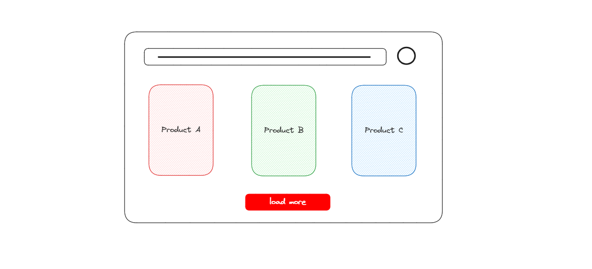
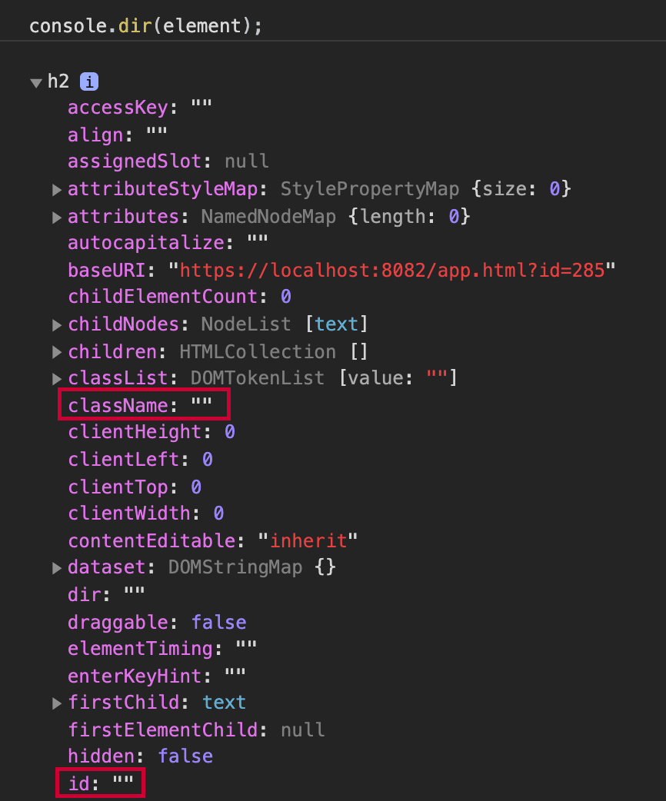
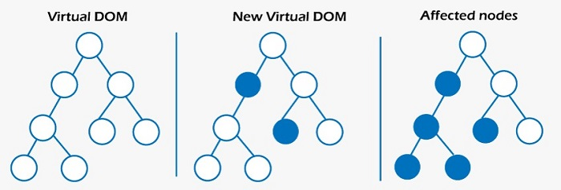

<hr />
<h1 align="center">Bienvenue sur cette formation dediée à l'apprentissage de ReactJS</h1>
<hr />

<h1 align="center">React Intro</h1>

[React](https://react.dev/) est une bibliothèque JavaScript créée et premièrement maintenue par **Facebook (Meta).**

### Short definition of React

[React](https://react.dev/) est une librarie JavaScript pour la création des interfaces utilisateurs.



### Longer definition

[React](https://react.dev/) est une bibliothèque (library) JavaScript qui est uniquement responsable de la **couche de vue de votre application (view layer)**. Cela signifie qu'elle est uniquement responsable du rendu de votre interface utilisateur (comme le texte, les zones de texte, les boutons, etc.) ainsi que de la mise à jour de l'interface utilisateur chaque fois qu'elle change.

**Par exemple**, disons que vous construisez un site Web de commerce électronique et que vous souhaitez maintenir le nombre d'articles dans le panier lorsque l'utilisateur ajoute et supprime des articles. [React](https://react.dev/) vous permet de spécifier plus facilement que vous souhaitez afficher le nombre d'articles dans le panier : `{items.length}`. React affichera cela (le nombre d'articles dans le panier) et le mettra à jour chaque fois qu'il change.

Il vous permet également de réutiliser cette logique dans une autre partie de votre interface utilisateur. Par exemple, sur la page de paiement ; vous pouvez réutiliser la même logique sans avoir à la réécrire.

### React is NOT a framework

React est une bibliothèque (librarie) et non un framework.
La différence entre une **bibliothèque** et un **framework** est que une bibliothèque vous aide seulement dans un aspect. En revanche, un framework vous aide dans plusieurs aspects. Prenons un exemple :

- [React](https://react.dev/) est une bibliothèque car elle ne s'occupe que de votre interface utilisateur.
- [Angular](), en revanche, est un framework car il gère bien plus que l'interface utilisateur (il gère l'injection de dépendances, l'encapsulation CSS, etc.).

### React is not about the design of your UI

React en soi n'est pas une bibliothèque d'interface utilisateur, car il ne vous fournit pas de boutons ou de cartes magnifiquement conçus.
Il vous aide à gérer une interface utilisateur complexe mais ne comprend pas de système de conception.
Il vous reviendra de choisir une bibliothèque de conception ou d'utiliser CSS pour le rendre agréable et convivial pour l'utilisateur.

### What about Web Components?

Un composant web est un ensemble d'API de la plateforme web qui vous permet de créer des balises HTML personnalisées, réutilisables et encapsulées à utiliser dans les pages web et les applications web. Ces composants peuvent être considérés comme des blocs de construction pour le développement web, offrant un moyen d'encapsuler la fonctionnalité et le style dans des éléments réutilisables.

Les composants web se composent de trois technologies principales :

- **Éléments personnalisés** : Les éléments personnalisés permettent aux développeurs de définir de nouveaux éléments HTML. Ces éléments peuvent encapsuler leur fonctionnalité et leur comportement, ce qui facilite leur réutilisation dans différentes parties d'une application web.

- **Shadow DOM** : Le Shadow DOM fournit une encapsulation pour le DOM et le CSS. Il vous permet de rattacher un "shadow" DOM séparé à un élément, isolant les styles et le comportement du composant du reste du document.

- **Modèles HTML** : Les modèles HTML permettent de définir des fragments de balisage qui peuvent être clonés et insérés dans le document au besoin. Cela est utile pour définir la structure d'un composant web sans le rendre immédiatement.

Ensemble, ces technologies permettent la création de composants réutilisables et encapsulés pouvant être utilisés dans différents frameworks et bibliothèques, favorisant la modularité, la maintenabilité et la réutilisabilité dans le développement web.

Exemple:

```html
<app-navbar> </app-navbar>
```

```javascript
class AppNavbar extends HTMLElement {
  constructor() {
    super();
    this.attachShadow({ mode: "open" });
    this.shadowRoot.innerHTML = "<h2>Hello Navbar</h2>";
  }
}

window.customElements.define("app-navbar", AppNavbar);
```

Vous pourriez utiliser des composants web pour développer une application web ; vous n'avez pas nécessairement besoin de React.
Vous pourriez également utiliser React pour compléter vos composants web et vice-versa.
Le principal avantage des composants web est qu'ils fonctionnent partout. Et le principal avantage de React est qu'il évolue plus rapidement que les composants web. Et c'est assez naturel car les composants web sont une norme (définie et implémentée par les navigateurs), tandis que React est une bibliothèque qui n'est pas normalisée.

#### Recap

> React is a JavaScript library for building User Interfaces.
> React is only responsible for the View layer.
> React is not a framework.

<p align="center">

</p>
<h1 align="center">Welcome To React</h1>

### Install & Setup

Pour installer le package React dans votre projet, vous devez l'installer à l'aide d'un gestionnaire de packages `(tel que npm ou yarn)`.
Nous utiliserons le Gestionnaire de Packages Node `(pnpm)` tout au long de ce cours.

```bash
pnpm install react
```

### Importing React

React ne fait pas partie du navigateur, donc vous devez l'importer dans chaque fichier JavaScript où vous en aurez besoin. Chaque fichier JavaScript est un module autonome, ce qui signifie que les variables, les fonctions et les importations dans un fichier/module ne affectent pas les autres fichiers/modules.

Voici comment vous pouvez importer React (en supposant que vous l'ayez déjà installé) :

```bash
import React from 'react';
```

Ceci est appelé une importation par défaut car elle suit la syntaxe suivante : `import Something from "nom-du-package"`;. Une exportation nommée serait importée comme ceci : `import {Something} from "nom-du-package"`;.

Notez comment nous importons depuis "react".
Ceci est appelé une importation directe car vous n'importe pas depuis un chemin de fichier. Exemple d'importation depuis un chemin de fichier : `import Something from "./fichier"`;. L'importation depuis un chemin de fichier commence toujours par `./.`

Lors de l'exécution d'un codeur de modules tel que `webpack, Parcel ou Vite`, alors les importations directes comme celles-ci sont résolues à partir de votre dossier `node_modules`.
Il recherchera `node_modules/react/` pour comprendre comment importer ce package.
C'est pourquoi vous devez d'abord installer react, ce qui le télécharge dans votre dossier `node_modules`.

### The React object

Lorsque vous importez React, vous obtenez un objet React qui contient des méthodes et des propriétés.
Nous allons apprendre progressivement les méthodes. Commençons par l'une des propriétés, qui est la version.
Une petite note en passant : une méthode est une fonction que vous devez appeler avec des parenthèses, tandis qu'une propriété est une valeur souvent précalculée.

React expose sa version actuelle via la propriété version ; voici comment vous pouvez la lire, en supposant que vous avez importé React :

```javascript
console.log(React.version); //18.2.0
```

### Import Cost

Chaque fois que vous avez une importation dans votre code, faites attention car vous ajoutez du code à votre application.
Nous vous informerons en vous indiquant la taille de chaque package mentionné dans ce cours.
Si vous avez configuré VSCode sur votre ordinateur, assurez-vous d'installer l'extension **Import Cost** car elle vous montrera la taille de vos importations.

Le coût de l'importation de React est d'environ `6.9 Ko`.

#### Recap

> Install react with pnpm install react
> Import React in every file you need it with import React from "react"
> Get the current React version with React.version
> React weighs 6.9KB when imported.

```javascript
import React from "react";

function getReactVersion() {
  return React.version;
}

const reactVersion = getReactVersion();

console.log(reactVersion); //18.2.0
```

## document.createElement

`document.createElement(tagName)` est une API Web fournie par les navigateurs qui vous permet de créer programmation un élément HTML.

Voici un rappel rapide de son fonctionnement :

```javascript
const element = document.createElement("h2");

// cela crée: <h2></h2>
// que vous pouvez ensuite insérer dans le DOM:
document.body.appendChild(element);
```

Nous ne sommes pas vraiment intéressés par l'insertion de cet élément dans le `DOM` pour le moment, donc pour l'instant concentrons-nous sur cette `document.createElement()`.

Elle crée un élément HTML, et nous pouvons voir toutes les propriétés en utilisant `console.dir(element)`, qui est une méthode fournie par les navigateurs pour lister toutes les propriétés d'un objet particulier.
Voici à quoi cela ressemble :



Vous n'aurez pas besoin de la plupart des propriétés que vous voyez ci-dessus. Cependant, les plus importantes qui apparaissent dans la liste complète sont :

- id
- style
- className

##### Comment changer la classe de l'élément ? Et le style ?

```javascript
const element = document.createElement("h2");
element.className = "nom-de-la-classe";
elment.style = "color: red; background-color: blue";
```

Vous vous demandez peut-être, pourquoi écrivons-nous tout cela en JavaScript ?
Vous devez savoir que ceci équivaut à créer directement l'élément suivant en HTML :

```html
<h2 class="nom-de-la-classe" style="color: red; background-color: blue"></h2>
```

#### Recap

> const `element = document.createElement(tagName)` creates an HTML element
> `element.style = "background-color: blue"` sets the background-color to blue
> `element.className = "container"` sets the class of the element to: container
> multiple classes can be set by separating them with a space character: element `className = "container center`"

```javascript
function createCard() {
  const card = document.createElement("div");
  card.className = "card";
  return card;
}
const card = createCard();
conssole.log(card); //
```

## React.creatElement

En React nous n'allons pas utiliser `document.createElement`.
Cependant, nous avons vu comment cela fonctionne car ils partagent quelques simularités avec `React.createElement`, mais ce n'est pas la même chose.

### Comparison

Comparins maintenant `document.createElement` et `React.createElement`

#### Return value

`document.createElement` renvoie un élement du DOM (DOM element) par exemple `(une div ou un h1)`. Par contre `React.createElement` renvoie un objet qui répresente l'element du DOM.
L'objet ressemble a quelque chose de la sorte:

```javascript
const element = React.createElement("h1");
//renvoie un objet similaire a ceci:

{
  type: 'h1',
  props: {}
}
```

La raison pour laquelle `React.createElement` renvoie un objet au lieu d'un element du DOM lui-même vient du fait que React opère sur le DOM virtuel (Virtual DOM).

Le Virtual DOM est lorsque la representation du UI est gardée dans la memoire et synced avec le DOM.

Donc `React.createElement()` renvoie un objet au lieu d'un élement du DOM parce cela permet à React de performer l'optimisation (comme le virtual DOM).

#### Changing class/style

C'est à ce nivau que les deux méthodes son similaires en terme de syntaxe:

```javascript
React.createElement("h1", { className: "center", style: "color: red" });
```

Remarquez que nous avons écrit `className` à la place de `class`, nous sommes entrain de prendre les mêmes proprietés que nous avons vu précedement.

#### Writing text

Pour écrire du text a l'interiere de l'element, vous devez ajouter un 3ème paramètre por `React.createElement`, appelé enfant (children), cela accepte également d'autres élements.

```javascript
React.createElement("h1", {}, "Hello World...!");
```

Ceci renvoie un objet représant `h1` qui contient **Hello World...!**.

Remarquez comment nous disons que nous ne voulons pas mettre un `className` ou bien `style`, alors nous passant `{}` comme second paramètre (Nous pouvons également passer `null`):

Nous allons utiliser le `JSX`, qui remplace le code tout en haut avec `<h1>Hello World...!</h1>`. Cependant, le `JSX` n'est pas du `HTML`, donc vous devriez apprendre `React.createElement` premièrement.

#### What is a React Element

En `React`, un `Element` est le plus petit bloc de construction (smallest building block).
Il représente à quoi ressemblera la plus petite partie de votre interface utilisateur. Dans son exemple le plus simple, cela pourrait être un paragraphe avec le texte "Bienvenue" à l'intérieur `(<p>Bienvenue</p>)`.
Vous verrez plus tard comment nous allons combiner plusieurs éléments React ainsi que des logiques avancées.

### Recap

> A React Element is the smallest building block.
> It's a representation of a small piece of your UI.
> React.createElement returns a React Element
> React.createElement(type, options, children)

```javascript
import React from "react";

// Create a Div element with React.createElement
function createDivElement() {
  return React.createElement(
    "div",
    {
      className: "card",
      style: {
        color: "red",
        fontSize: "2rem",
      },
    },
    "Hello world!"
  );
}

// Create a title element with React.createElement

function createTitle(){
  return React.createElement("h1", {
    className: "title
  }, "Welcome to brx-hashcode")
}
```

<h1 align="center">RactDOM Intro </h1>

<p align="center"></p>

**ReactDOM** est la liaison entre React et le DOM.
React crée une représentation virtuelle de votre interface utilisateur (dans ce que nous appelons un DOM virtuel). Ensuite, **ReactDOM** est la bibliothèque qui met à jour efficacement le DOM en fonction de ce DOM virtuel.

Le DOM virtuel existe pour déterminer quelles parties de l'interface utilisateur doivent être mises à jour, puis regrouper ces changements ensemble. **ReactDOM** reçoit ces instructions de React, puis met à jour efficacement le DOM.

### Why is it a separate library?

Il y a quelques années, `React` et `ReactDOM` faisaient partie de la même bibliothèque appelée `React`.
Cependant, ils ont été divisés en deux bibliothèques distinctes : `React` et `ReactDOM`, afin de permettre le lancement de [React Native](https://reactnative.dev/).

`React Native` est la liaison entre `React` et les `applications natives`. `React Native` est en dehors du cadre de ce cours, mais comme vous pouvez le constater, React est la bibliothèque qui vous permet d'écrire une interface utilisateur réutilisable, puis :

- ReactDOM rend cette interface utilisateur visible dans le navigateur web.
- React Native rend cette interface utilisateur visible dans une application native. Il est important de se rappeler que la bibliothèque React n'a rien à voir avec un navigateur web
- ReactDOM lie l'idée de React à un navigateur web (exemple : Firefox, Chrome, Safari, Edge, etc.).
- Alors que React Native lie l'idée de React à une application native (exemple : Android natif, iOS natif).

### Reconciliation

React crée la représentation virtuelle de votre interface utilisateur en mémoire, puis ReactDOM la reçoit et synchronise votre interface utilisateur (ainsi que les modifications qui y sont apportées) avec le DOM. Ce processus est appelé réconciliation.

En tant que développeur React, il s'agit d'une fonctionnalité que vous obtenez dès le départ avec React. Vous n'avez pas à vous soucier de son fonctionnement (cependant, nous verrons plus tard dans ce cours pourquoi l'immuabilité est nécessaire pour que la réconciliation fonctionne).

<br />

<p align="center"></p>

### Recap

> ReactDOM is the glue between React and the DOM.
> ReactDOM is separate from React because you can write React for native applications.
> Reconciliation is the process of syncing the Virtual DOM to the actual DOM.

<h1 align="center">RactDOM Usage </h1>

Commençons par installer ReactDOM :

```bash
npm install react-dom
```

C'est quelque chose que vous devez faire en plus de l'installation précédente.
Donc, si vous commenciez à partir de zéro, vous devriez installer les deux packages (react & react-dom) de cette manière :

```bash
npm install react react-dom
```

#### Import Cost

Quel est le poids de ReactDOM ? ReactDOM pèse 130 Ko.
Donc, en tout, React + ReactDOM pèsent 130 + 6 = 136 Ko.

Lors du développement de produits pour les marchés émergents ou les marchés avec des connexions Internet lentes, vous pouvez envisager une alternative plus légère comme [Preact](https://preactjs.com/).

#### Importing ReactDOM

Nous n'aurons besoin d'importer qu'une seule méthode appelée `createRoot`. Cette méthode peut être importée depuis `react-dom/client`.

```bash
import { CreateRoot } from "react-dom/client
```

#### Root of your app

Nous utilisons ReactDOM pour rendre (visualiser) nos éléments React sur la page.
Pour ce faire, vous devez indiquer à ReactDOM où rendre ces éléments.
Nous appelons cet élément la racine.
Il s'agit d'un élément `<div>` avec un identifiant de root ou app-root ou react-root ou tout autre nom que vous préférez.
Prenons root pour cet exemple :

```html
<div id="root"></div>
```

#### Render your first Element

Avec l'élément root ci-dessus, nous pouvons maintenant rendre notre premier élément React :

```javascript
import React from "react";
import { createRoot } from "react-dom/client";

const root = document.querySelector("#root");
createRoot(root).render(React.createElement("p", {}, "Hello World"));
```

Cela affichera un `<p>Bonjour le monde</p>` sur votre écran, car la méthode `createRoot().render()` de `ReactDOM` reçoit un élément React (une représentation virtuelle) puis le rend visible dans le DOM réel.
Démontons le code :

1. Nous commençons par obtenir une référence à l'élément `root` de la page `(en utilisant querySelector ou getElementById)`.
2. Nous créons la racine de l'application `React` en utilisant `createRoot(root)`.
3. Sur le résultat de `createRoot(root)`, nous appelons `.render()` et lui passons notre élément `React`.

### React 16

Il y avait autrefois une méthode `render` exportée depuis `react-dom`. Cela a été obsolète dans `React 18` pour laisser place aux fonctionnalités concurrentes de `React 18`. Si vous voyez le code ci-dessous, notez qu'il est obsolète (mais fonctionne toujours dans `React 18`) :

```javascript
import React from "react";
import { render } from "react-dom";

const root = document.querySelector("#root");
render(React.createElement("p", {}, "Hello World"), root);
```

### Recap

> Install ReactDOM with `pnpm install react-dom`
> Import ReactDOM's `createRoot` method with `import {createRoot} from "react-dom/client"`
> ReactDOM weighs 130KB when imported.
> The root element is where ReactDOM will render your UI
> `createRoot(root).render(element)`;

```javascript
import React from "react";
import { render } from "react-dom";

const root = document.getElementById("react-root");
const element = React.createElement("p", {}, "Hello World");

render(element, root);
```

## Root Element

Nous aimerions approfondir davantage le concept de l'élément racine (root element), qui pourrait également être appelé le conteneur (container).

Cet élément racine que vous passez à `ReactDOM` deviendra entièrement géré par `ReactDOM`. Vous ne devriez donc pas écrire de JavaScript qui modifie son contenu.

Donc une fois que vous avez :

```html
<div id="app-root"></div>
```

```javascript
import React from "react";
import { createRoot } from "react-dom/client;

const appRoot = document,querySelector("#app-root");

createRoot(appRoot).render(React.createElement("h1", {}, "Hello World!"))
```

Vous ne devez rien faire d'autre avec la variable root et le `<div id="react-root">...</div>` car `ReactDOM` s'en chargera.
Nous disons que c'est géré par `ReactDOM` parce que plus tard, vous rendrez des choses plus compliquées que des éléments qui seront mises à jour à l'avenir. Et `ReactDOM` se chargera de ces mises à jour.

#### Use cases

Il existe deux principaux cas d'utilisation pour React ; voici comment ils affectent l'élément racine :

- ##### Apps built with React

  Une application construite avec React a généralement un seul élément racine, comme nous le verrons tout au long de ce cours. L'ensemble de l'application est rendu à l'intérieur de cet élément racine.

- ##### Integrate React into an existing App

  Par exemple, supposons que vous ayez un site web de supermarché construit avec `Ruby on Rails ou Laravel` (un framework backend pour Ruby et PHP respectivement), et que vous souhaitiez rendre la fonctionnalité du panier interactive, vous pourriez décider d'utiliser React pour rendre cela possible.

  Dans ce cas, la logique du panier irait dans un élément racine `<div id="react-cart"></div>`. Et votre application pourrait potentiellement contenir plus d'un élément racine à l'avenir.

### Recap

> ReactDOM completely manages the root element
> You should not directly change/update the content of the root element
> Apps built with React have a single root element (The most common use case)
> Existing Apps that integrate React to make a feature interactive could have more than one root.

<h1 align="center">Chapiter Recap </h1>

Vous avez peut-être remarqué que nous vous avons demandé d'importer `React` chaque fois que vous utilisez `React.createElement` ; c'est parce que nous voulons nous assurer que vous comprenez ce concept et vous y habituez.

À la longue, cela devient ennuyeux, donc nous vous faciliterons la tâche plus tard dans ce cours.

`React.createElement` est une syntaxe assez longue. Cependant, c'est la base de `JSX`. Qu'est-ce que `JSX` et comment fonctionne-t-il ? Découvrons-le dans le prochain chapitre.

Récapitulatif du chapitre :

- `ReactDOM` est la liaison entre React et le DOM.
- `ReactDOM` est séparé de React.
- `ReactDOM` peut être installé avec `pnpm install react-dom`.
- Importez la méthode `createRoot` de `ReactDOM` avec `import {createRoot} from "react-dom/client"`.
- `createRoot(root).render(element)`;
- `La réconciliation` est le processus de synchronisation du DOM virtuel avec le DOM réel.
- `ReactDOM` gère complètement l'élément racine.
- Vous ne devez pas changer/mettre à jour directement le contenu de l'élément racine.
- Les applications construites avec `React` ont un seul élément racine (le cas d'utilisation le plus courant).

<h1 align="center">Le JSX</h1>


### Intro to JSX

Lorsque vous travaillez avec `React`, vous devrez utiliser `React.createElement` pour représenter votre interface utilisateur. Cependant, comme vous avez pu le constater, la syntaxe est longue. Elle deviendra encore plus longue et fastidieuse lorsque vous commencerez à avoir une interface utilisateur plus compliquée.

`React` utilise une syntaxe spéciale appelée `JSX` pour résoudre ce problème.
Cette syntaxe JSX peut sembler similaire à `HTML, mais ce n'est PAS HTML`.

Let's see an example:

```javascript
import React from "react";

const title = <h1>Hello World</h1>;
```

Bien que cela ressemble à du HTML, ce n'est vraiment pas du HTML.

Le code ci-dessus est traduit comme suit :

```javascript
import React from "react";

const title = React.createElement("h1", {}, "Hello World");
```

Le premier est plus facile à lire, car vous exprimez que vous devez créer un élément qui est un h1 contenant Bonjour le monde.

#### JSX is syntactic sugar for React.createElement 🌟

`JSX` vous fournit du sucre syntaxique (en rendant la lecture/écriture plus agréable) pour la fonction `React.createElement`.

Au lieu de vous obliger à écrire `React.createElement` à chaque fois, vous pouvez écrire l'élément en `JSX`.

Rappelez-vous toujours que le `JSX` que vous écrivez est converti en `React.createElement`. Ainsi, `JSX` est créé pour vous faciliter la description de votre interface utilisateur (UI).

#### ⚠️ JSX is NOT part of the browser ⚠️

Votre navigateur ne peut pas comprendre JSX car c'est une syntaxe créée par React.
Vous aurez besoin d'un outil (comme [Babel](https://babeljs.io/repl#?browsers=&build=&builtIns=false&corejs=3.21&spec=false&loose=false&code_lz=MYewdgzgLgBApgGzgWzmWBeGAeAFgRgD4AJRBEGAdRACcEATbAegMKA&debug=false&forceAllTransforms=false&modules=false&shippedProposals=false&circleciRepo=&evaluate=false&fileSize=false&timeTravel=false&sourceType=module&lineWrap=true&presets=es2015%2Creact&prettier=false&targets=&version=7.24.0&externalPlugins=&assumptions=%7B%7D)) pour convertir votre code JSX en JavaScript normal (qui contiendra les appels à React.createElement).

Nous aborderons cela plus tard avec `create-react-app et Vite`.

Ce cours a été configuré de manière à simuler `create-react-app/Vite` afin que vous puissiez écrire du JSX, qui sera converti en `React.createElement(...)`.

#### JSX doesn't require React to be in scope (anymore) 😜

Avant React 17, vous deviez importer React pour que votre JSX fonctionne dans chaque fichier où vous utilisiez JSX.

Ce n'est plus nécessaire.

Si vous mettez à niveau un code source depuis React 16, vous pouvez laisser l'importation de React; cela ne causera aucun dommage.

Voici une capture d'écran montrant comment le code JSX que vous écrivez à gauche est transformé en React.createElement() à droite.


